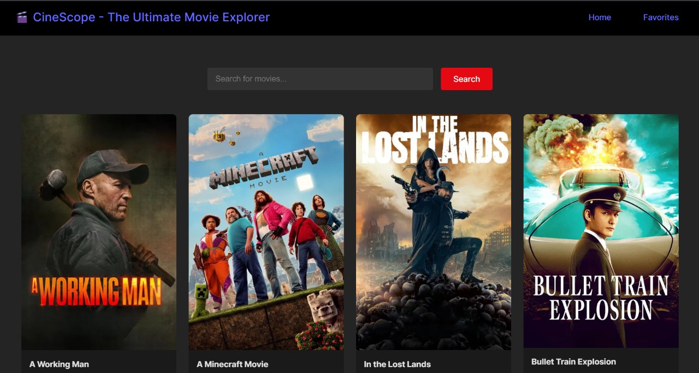
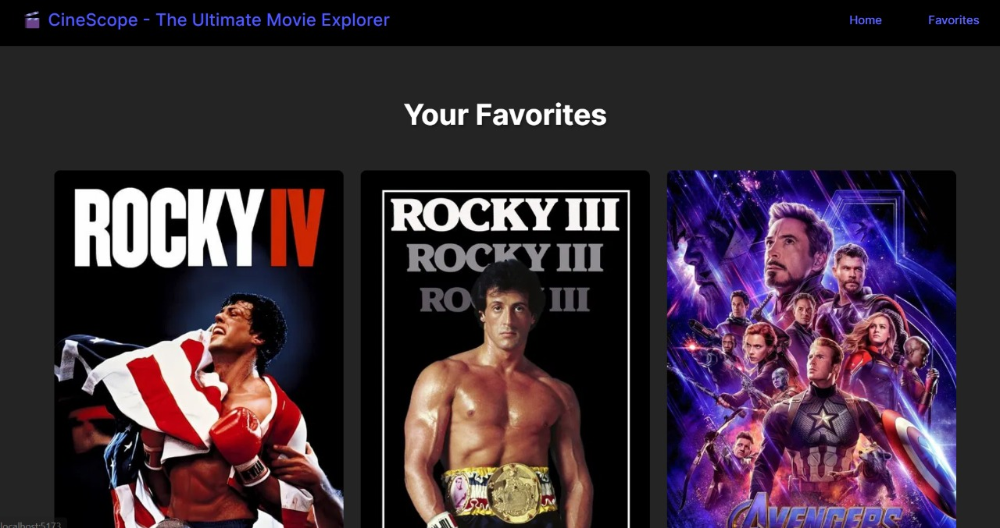

# 🎬 CineScope - The Ultimate Movie Explorer
A responsive and modern **React** application that allows users to **search movies**, view **popular listings**, and manage a **favorites list**. Built with **Vite** for lightning-fast development and powered by the **TMDb (The Movie Database)** API.

---

## 📌 Table of Contents

- [Features](#features)
- [Screenshots](#screenshots)
- [Tech Stack](#tech-stack)
- [Getting Started](#getting-started)
- [Project Structure](#project-structure)
- [Environment Variables](#environment-variables)
- [Usage](#usage)
- [Future Improvements](#future-improvements)
- [Acknowledgements](#acknowledgements)
- [License](#license)

---

## ✨ Features

- 🔥 **Popular Movies Display**: Loads trending/popular movies from TMDb on app start.
- 🔍 **Search Functionality**: Search for any movie by title using the TMDb API.
- ❤️ **Favorites System**: Add or remove movies from a favorites list with a heart button.
- 📀 **Context API State Management**: Uses a custom `useMovieContext` hook to manage global state.
- ⚡ **Built with Vite**: Instant startup and lightning-fast hot module replacement.
- 🎨 **Responsive UI**: Clean CSS styling with responsive layout for different screen sizes.

---

## 📸 Screenshots

<!-- Replace with your actual screenshots -->
| Home Page | Favorites |
|----------|-----------|
|  |  |

---

## 🪰 Tech Stack

- **Frontend:** React, JSX, CSS
- **Build Tool:** Vite
- **State Management:** useState, useEffect, Context API
- **API:** [TMDb API](https://developers.themoviedb.org/)

---

## 🛠️ Getting Started

### 1. Clone the repository

```bash
git clone https://github.com/yourusername/movie-search-engine.git
cd movie-search-engine
```

### 2. Install dependencies

```bash
npm install
```

### 3. Add your TMDb API key

Create a `.env` file in the root directory and insert your API key:

```env
VITE_TMDB_API_KEY=your_tmdb_api_key_here
```

> You can get an API key by signing up at [TMDb Developer Portal](https://www.themoviedb.org/documentation/api).

### 4. Run the development server

```bash
npm run dev
```

The app should now be running at `http://localhost:5173`.

---

## 📁 Project Structure

```
ReactMovieSearch/
├── public/
│   └── vite.svg
├── src/
│   ├── assets/
│   │   └── react.svg
│   ├── components/
│   │   ├── MovieCard.jsx
│   │   └── NavBar.jsx
│   ├── contexts/
│   │   └── MovieContext.jsx
│   ├── css/
│   │   ├── App.css
│   │   ├── Favorites.css
│   │   ├── Home.css
│   │   ├── index.css
│   │   ├── MovieCard.css
│   │   └── Navbar.css
│   ├── pages/
│   │   ├── Favorites.jsx
│   │   └── Home.jsx
│   ├── services/
│   │   └── api.js
│   ├── App.jsx
│   └── main.jsx
├── .gitignore
├── package.json
├── vite.config.js
└── README.md
```

---

## 🔐 Environment Variables

To run this project, you will need to add the following environment variable in a `.env` file at the root:

```env
VITE_TMDB_API_KEY=your_tmdb_api_key
```

---

## 🧪 Usage

- **Search Movies:** Type a movie name in the search bar to fetch results.
- **Add to Favorites:** Click the ❤️ icon on any movie card to add it to your favorites list.
- **View Favorites:** Favorites are accessible in a dedicated section.
- **Remove from Favorites:** Click the ❤️ again to remove from favorites.

---

## 🚧 Future Improvements

- ✅ Add movie detail pages
- ✅ Store favorites using `localStorage` or `IndexedDB` for persistence
- ✅ Add genre filters, sort by rating/release date
- ✅ Pagination for long search results
- ✅ Dark mode toggle

---

## 🙏 Acknowledgements

- [The Movie Database (TMDb)](https://www.themoviedb.org/) for the public movie API.
- [React](https://reactjs.org/)
- [Vite](https://vitejs.dev/)

> **Disclaimer:** This product uses the TMDb API but is not endorsed or certified by TMDb.

---


## 👤 Author
Vishnu Vandhan Talakokkula
🔗 [GitHub](https://github.com/VishVandhan004)  

