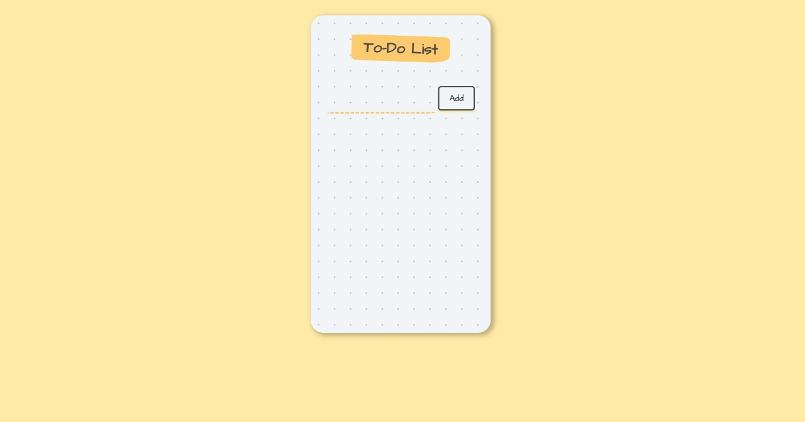
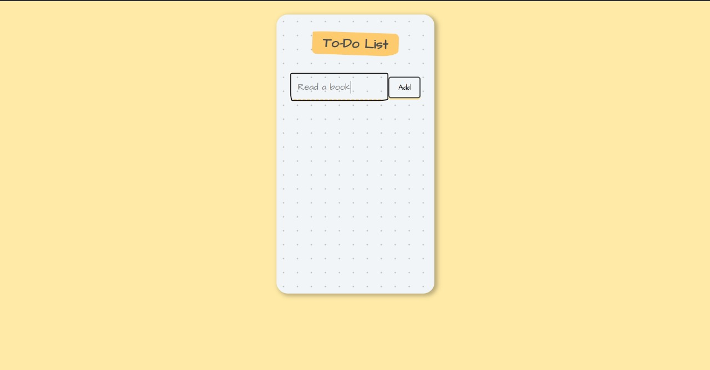
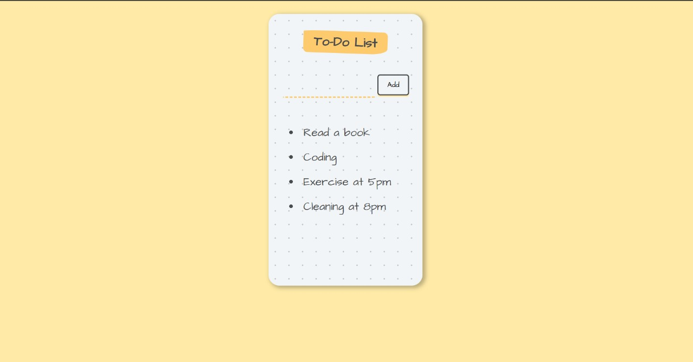

# TaskFlow - A Modern To-Do List App

The **TaskFlow - A Modern To-Do List App** is a simple and interactive task management application built using **React.js, JavaScript (ES6), HTML, and CSS**. It allows users to dynamically add and manage tasks with a seamless UI experience. The app leverages **React’s state management** for real-time updates and ensures a smooth workflow by automatically clearing input fields after adding tasks. With a **modular component-based structure**, it is designed for scalability and easy customization. Future enhancements include **task deletion, local storage integration, and a completion tracking system** for improved functionality. The App is deployed using Vercel.

## 🚀 Deployed Application
[Click here to view the live app!](https://vishnus-react-to-do-list.vercel.app/)

## Features  
✅ Add new tasks to the to-do list  
✅ View all tasks in a structured format  
✅ Automatically clears input after adding a task  
✅ Simple and clean UI  

## Technologies Used  
- React.js  
- JavaScript (ES6)  
- HTML  
- CSS  
- Vercel

## Installation  

1. **Clone the Repository:**  
   ```bash
   git clone https://github.com/your-username/React_ToDoList.git
   ```
2. **Navigate to the Project Directory:**  
   ```bash
   cd React_ToDoList
   ```
3. **Install Dependencies:**  
   ```bash
   npm install
   ```
4. **Start the Development Server:**  
   ```bash
   npm start
   ```
5. Open **http://localhost:3000/** in your browser to see the app.  

## UI Screenshots  

### 📌 Home Screen  
  

### 📌 Adding a Task  
  

### 📌 Task Added to List  
  

## Project Structure  
```
React_ToDoList
│── public
│── src
│   ├── components
│   │   ├── App.jsx        # Main React component
│   ├── index.js          # Renders the app
│── package.json         # Dependencies and scripts
│── README.md            # Documentation
```


## How It Works  
1. The app maintains two state variables:  
   - `inputText` → Stores the text entered by the user.  
   - `items` → Stores the list of tasks.  
2. When the user types in the input field, the `handleChange` function updates the `inputText` state.  
3. When the **Add** button is clicked:  
   - The `addItem` function updates the `items` state by adding the new task.  
   - The input field is cleared for new entries.  
4. The app dynamically renders all tasks as a list using the `.map()` method.  


## Future Improvements  
🔹 Add a **delete** button to remove tasks  
🔹 Implement **local storage** to save tasks after refreshing  
🔹 Add **checkboxes** to mark tasks as completed  

## Author  
Vishnu Vandhan – [GitHub Profile](https://github.com/VishVandhan004)  
