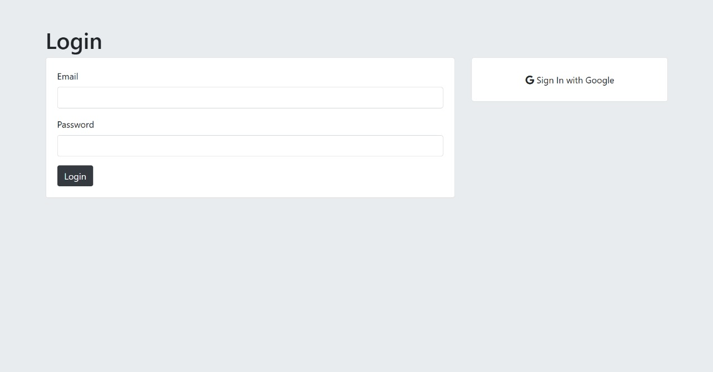
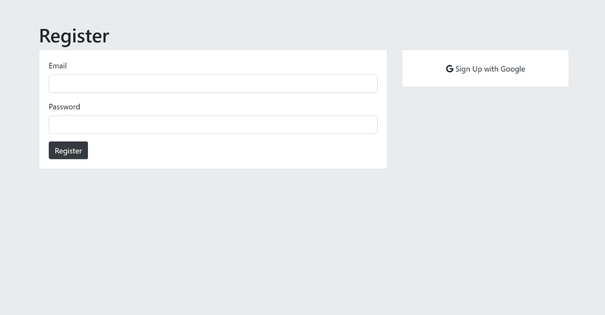

# 🔐 Secrets Authentication App  

A secure authentication web application built using **Node.js, Express, PostgreSQL, Passport.js, and EJS templating** to allow users to securely log in, register, and submit anonymous secrets.

## 🚀 Features  
✅ **User Authentication:** Supports local login with **bcrypt hashing** and **Google OAuth** authentication.  
✅ **Session Management:** Uses **express-session** and **passport.js** for secure session handling.  
✅ **Secrets Page:** Users can submit and view anonymous secrets.  
✅ **Templating with EJS:** Modular UI components with partials for **header** and **footer**.  
✅ **Database Integration:** Stores user credentials and secrets in **PostgreSQL**.  
✅ **Secure Password Handling:** Hashes passwords using **bcrypt** with salt rounds.  

## 🛠️ Tech Stack  
- **Backend:** Node.js, Express.js  
- **Authentication:** Passport.js (Local & Google OAuth)  
- **Database:** PostgreSQL  
- **Security:** Bcrypt for password hashing, dotenv for environment variables  
- **Templating Engine:** EJS  
- **Styling:** CSS  

## 📂 Folder Structure  
```
/Secrets3  
│── /css                  # CSS files  
│   ├── styles.css  
│  
│── /node_modules         # Dependencies  
│  
│── /partials             # Reusable EJS components  
│   ├── footer.ejs  
│   ├── header.ejs  
│  
│── /public/css           # Public stylesheets  
│   ├── styles.css  
│  
│── /views                # Main EJS pages  
│   ├── /partials         # Reusable EJS components  
│   ├── home.ejs  
│   ├── login.ejs  
│   ├── register.ejs  
│   ├── secrets.ejs  
│   ├── submit.ejs  
│  
│── .env                  # Environment variables  
│── .gitignore            # Ignored files  
│── package.json          # Project metadata  
│── package-lock.json     # Dependencies lock file  
│── solution.js           # Main server file  
```

## ⚙️ Installation  

1️⃣ Clone the repository:  
```sh
git clone https://github.com/yourusername/Secrets3.git
cd Secrets3
```
2️⃣ Install dependencies:  
```sh
npm install
```
3️⃣ Set up **.env** file:  
```
SESSION_SECRET=your_secret  
PG_USER=your_pg_user  
PG_HOST=your_pg_host  
PG_DATABASE=your_pg_db  
PG_PASSWORD=your_pg_password  
PG_PORT=your_pg_port  
GOOGLE_CLIENT_ID=your_google_client_id  
GOOGLE_CLIENT_SECRET=your_google_client_secret  
```
4️⃣ Start the server:  
```sh
nodemon solution.js
```
5️⃣ Open in browser:  
```
http://localhost:3000
```

---

## 🖼️ Screenshots  

### 🔐 Login Page  
  

### 🏠 Home Page  
  

### 📝 Register Page  
  

---

## 🔑 Authentication Flow  
1️⃣ **Register/Login** using email/password or Google OAuth.  
2️⃣ **Session Management** keeps users logged in.  
3️⃣ **Submit Secrets** anonymously to the database.  
4️⃣ **Logout** to end the session.  

## 📝 API Routes  
| Method | Route          | Description |  
|--------|--------------|-------------|  
| GET    | `/`          | Home page |  
| GET    | `/login`     | Login form |  
| GET    | `/register`  | Register form |  
| POST   | `/register`  | Handles user registration |  
| POST   | `/login`     | Handles user login |  
| GET    | `/logout`    | Logs out user |  
| GET    | `/secrets`   | View submitted secrets (authenticated users only) |  
| POST   | `/submit`    | Submit a secret |  
| GET    | `/auth/google` | Google OAuth login |  

## 🛡️ Security Features  
✔ **Bcrypt Hashing:** Securely stores passwords  
✔ **Environment Variables:** Hides sensitive credentials  
✔ **Session Authentication:** Uses cookies securely  
✔ **OAuth Integration:** Secure login with Google  

## 📌 Future Enhancements  
🚀 Add email verification for new users  
🚀 Implement password reset functionality  
🚀 Add user profile page  

---

### 🎯 Developed by **Vishnu Vandhan**  
🔗 GitHub: [yourgithub](https://github.com/VishVandhan004)  